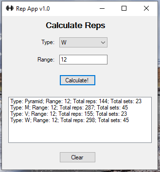
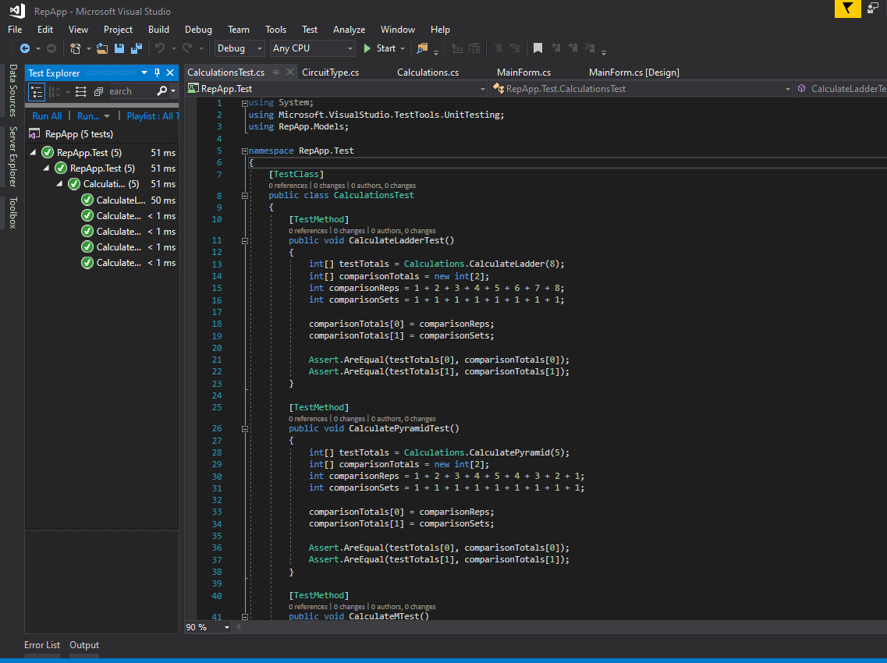

## Rep App

A desktop app that outputs the amount of repetitions on different kinds of circuit training based on a max rep range.

This app was developed in order to understand the basics of the toolbox elements on WinForms as well how to use the unit testing feature in the .NET environment.

These are some of the outputs of the app:

And these are the outputs of some tests:

